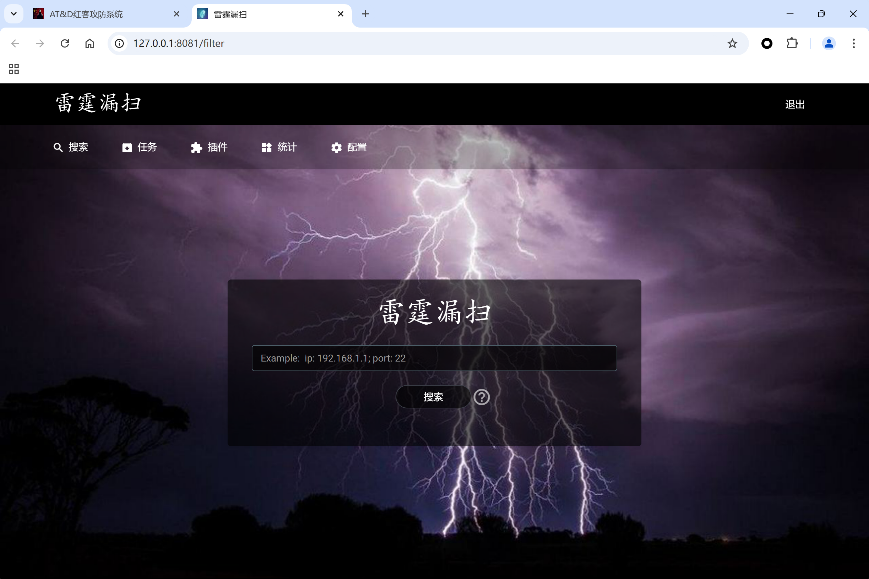
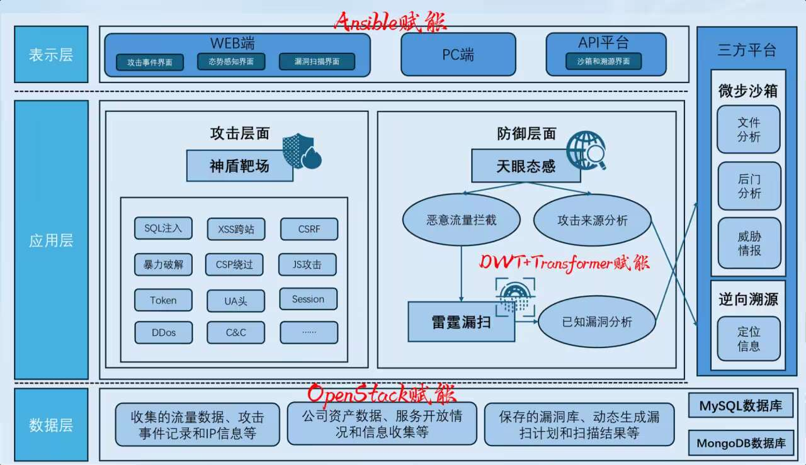
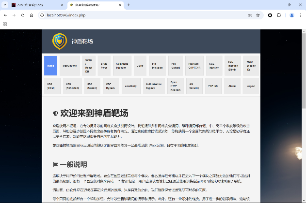
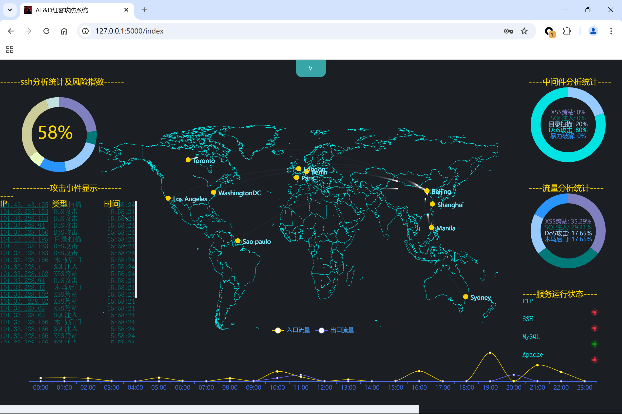
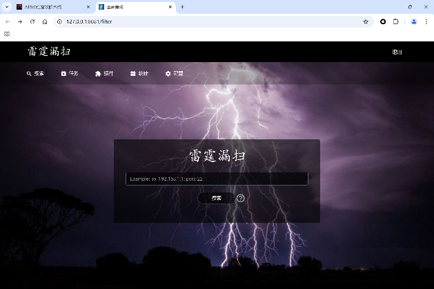
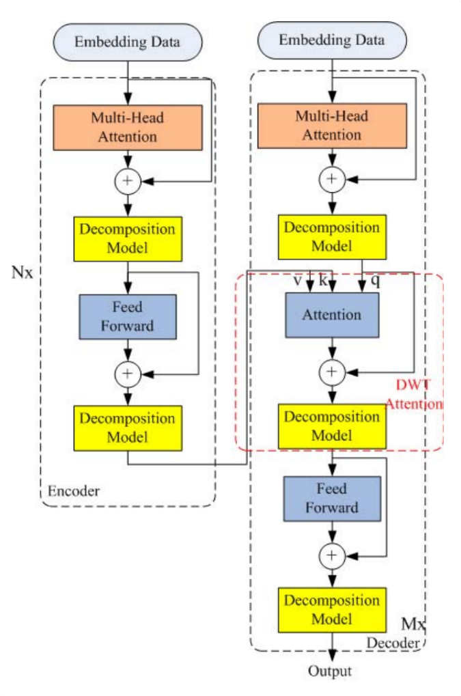
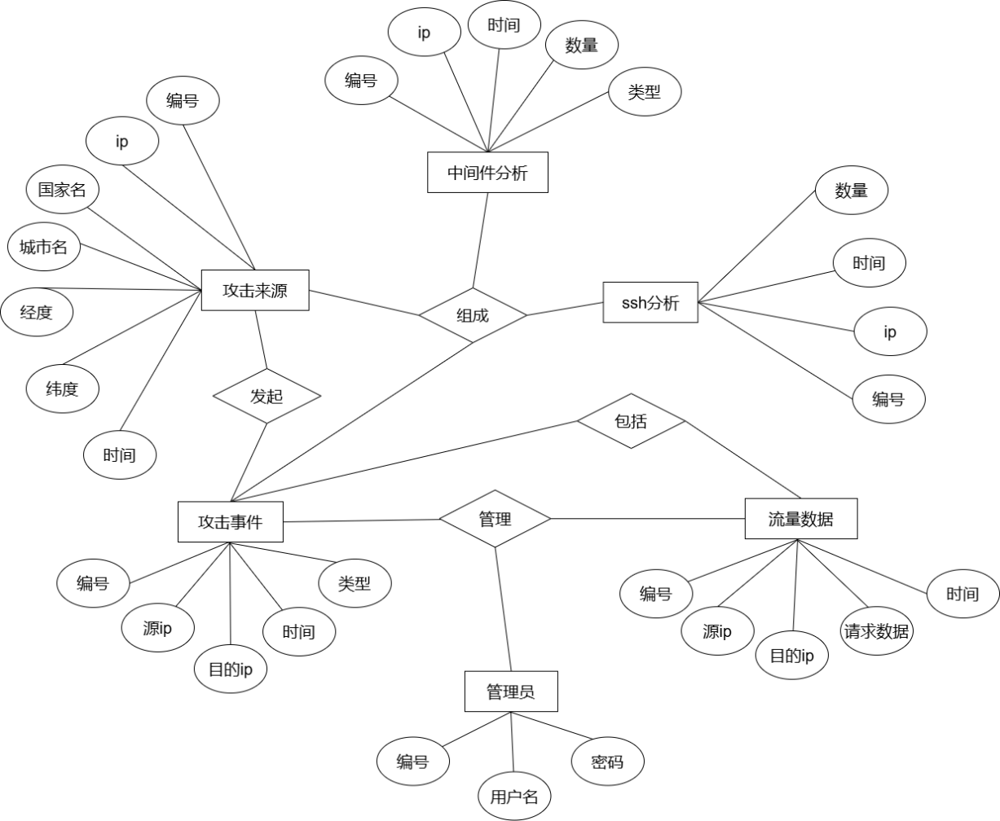

<div align="center">
  
  <h1>🛡️ AT&D 红客攻防系统</h1>
  <p><strong>Attack & Defense — 集攻防演练、智能监测、漏洞扫描于一体的综合网络安全防护平台</strong></p>
  <p>
    
    
    
  </p>
</div>

---

## 📋 目录

- [项目简介](#项目简介)
- [系统架构](#系统架构)
- [核心模块](#核心模块)
  - [模块一：神盾靶场](#模块一神盾靶场)
  - [模块二：天眼态感](#模块二天眼态感)
  - [模块三：雷霆漏扫](#模块三雷霆漏扫)
  - [模块四：深度学习入侵检测系统](#模块四深度学习入侵检测系统ids)
- [外部协同接口](#外部协同接口)
- [创新点](#创新点)
- [技术栈](#技术栈)
- [安装部署](#安装部署)
- [参考文献](#参考文献)
- [许可证](#许可证)

---

## 🎯 项目简介

**AT&D 红客攻防系统** 是一个集攻防演练、深度学习入侵检测、漏洞扫描与修复、安全监控、流量分析、文件分析与溯源为一体的 **综合网络安全防护平台**。系统以"攻击视角评估防御、智能算法驱动检测、自动化工具辅助修复"为设计理念，为企业和安全团队提供一站式安全解决方案。

### 核心目标

1. **全面的攻防演练平台** — 模拟多种真实网络攻击场景，提升应对复杂网络攻击的能力
2. **智能安全事件监控与分析** — 结合深度学习和流量分析，实时监控网络状态，精准识别潜在威胁
3. **自动化漏洞扫描与风险评估** — 自动化检测网络环境中的已知和未知漏洞，评估风险并提供修复建议
4. **高效攻击溯源与报告生成** — 追踪攻击路径和源头，生成攻击报告
5. **文件分析与溯源** — 对可疑文件进行深度分析，识别恶意文件并追踪来源
6. **简便易用的操作界面** — 直观的 Web 用户界面设计

---

## 🏗️ 系统架构

系统采用 **多层防御 + 智能分析 + 实时漏洞更新 + 靶场模拟攻击** 的综合安全防护架构设计，分为攻击与防御两个层面，并引入深度学习技术。


### 系统框架图

<div align="center">
  
  <p><em>图2: 系统框架图</em></p>
</div>


### 数据流与工作流程

系统整体工作流程：

1. **神盾靶场** 模块模拟攻击场景产生网络流量
2. **天眼态感** 服务器收集网络流量，分析攻击来源与恶意流量
3. 判定为攻击时，**深度学习 IDS** 被触发进行自动模式识别和异常行为分析
4. **雷霆漏扫** 对公司内网进行漏洞扫描，定位漏洞服务器，匹配 N-day 漏洞
5. 处置阶段：删除后门、打补丁修复，同时由微步沙箱和逆向溯源提供外部协同


---

## 🧩 核心模块

### 模块一：神盾靶场

<div align="center">
  
  <p><em>图7: 神盾靶场 — 基于 DVWA 二次开发的 Web 漏洞靶场</em></p>
</div>

**功能描述：** 基于 DVWA（Damn Vulnerable Web Application）二次开发，模拟存在漏洞的网站环境，供安全人员进行渗透测试和攻防演练。系统故意引入 **OWASP Top 10** 漏洞，涵盖从 Low 到 Impossible 四个难度级别。

**包含漏洞类型：**

| 漏洞类型 | 难度 | 说明 |
|---------|------|------|
| SQL 注入 | Low ~ High | 基础 SQL 注入与盲注 |
| XSS（反射型/存储型/DOM型） | Low ~ Impossible | 跨站脚本攻击 |
| CSRF | Low ~ Impossible | 跨站请求伪造 |
| 文件上传 | Low ~ Impossible | 文件包含与上传漏洞 |
| 命令执行 | Low ~ Impossible | 远程命令执行 |
| 暴力破解 | Low ~ Impossible | 登录暴力破解 |
| 文件包含 | Low ~ Impossible | 本地/远程文件包含 |
| CAPTCHA 绕过 | Low ~ Impossible | 验证码绕过 |
| CSP 绕过 | Low ~ Impossible | 内容安全策略绕过 |
| 认证绕过 | Low ~ Impossible | 身份验证绕过 |
| 弱会话 ID | Low ~ Impossible | 会话劫持 |
| 开放重定向 | Low ~ Impossible | URL 重定向漏洞 |

**目录：** `AG/`

---

### 模块二：天眼态感

<div align="center">
  
  <p><em>图8: 天眼态感 — 态势感知可视化大屏</em></p>
</div>

**功能描述：** 基于 Flask 框架开发的网络安全态势感知平台，提供出入流量监控、恶意流量拦截、公司资产状况宏观可视化展示及 WAF 输入验证。

**主要功能：**

- **实时流量监控与分析** — 捕获网络流量，实时分析协议分布、流量趋势
- **攻击事件检测** — 检测 XSS、SQL 注入、目录扫描、DoS 攻击、暴力破解、木马后门、SSH 爆破等 7 类攻击
- **IP 地理位置映射** — 利用 MaxMind GeoLite2 数据库，将攻击源 IP 映射到全球地图
- **Web 日志分析** — 分析 Apache 访问日志，识别恶意请求
- **中间件与进程监控** — 监控 Apache、MySQL、vsftpd、SSH 等服务的运行状态
- **自动防御** — 自动封禁恶意 IP，邮件告警（QQ SMTP）
- **数据可视化** — 基于 ECharts 的多样化图表展示

**目录：** `NSSA/`

---

### 模块三：雷霆漏扫

<div align="center">
  
  <p><em>图9: 雷霆漏扫 — 网络资产与漏洞扫描管理平台</em></p>
</div>

**功能描述：** 基于 Python 开发的网络资产与漏洞扫描平台，自动化检测内网服务器的健康状况，包括日常基线检查和攻击后排查。

**扫描能力：**

- **资产发现：** ICMP 扫描、CIDR 网段扫描、Masscan 高速端口扫描
- **漏洞检测：** 内置 43+ 漏洞检测插件，覆盖：
  - **系统漏洞：** MS17-010（永恒之蓝）、MS15-034、MS10-070
  - **Web 漏洞：** Apache、Nginx（CVE-2017-7529）、IIS、Tomcat
  - **中间件漏洞：** WebLogic、WebSphere、JBoss、Jetty、Resin、GlassFish、Axis
  - **框架漏洞：** Struts2、Shiro-550、Jenkins
  - **服务弱口令：** FTP、MySQL、MSSQL、PostgreSQL、MongoDB、Redis、Memcache、Rsync、ZooKeeper
  - **其他：** Heartbleed、Shellshock、Docker Remote API、Hadoop YARN、ElasticSearch
- **多线程并行扫描**，支持定时任务
- **Web 管理控制台** — 任务管理、插件管理、结果分析
- **Excel 报告导出**

**技术架构：** Python + MongoDB + Masscan + Kunpeng 插件体系 + Web 管理界面

**目录：** `TS/`

---

### 模块四：深度学习入侵检测系统 (IDS)

<div align="center">
  
  <p><em>图10: 基于 Transformer 和多小波注意力学习的入侵检测算法架构</em></p>
</div>

**技术特色：** 基于 **Transformer 和多小波注意力学习** 的实时入侵检测系统（基于指导老师已发表的 IEEE IoT Journal 2024 论文研究成果）。

**算法流程：**

1. **数据预处理：** 基于 IoT-23 和 NSL-KDD 数据集，进行去噪、z-score 标准化、时间序列分割
2. **特征提取：** 离散小波变换（DWT）多尺度分解 + 多小波学习策略
3. **位置嵌入：** 保留时序信息，生成频谱图表示
4. **Transformer 编码器：** 自注意力机制建立序列不同位置的联系
5. **分类输出：** 多尺度特征融合后通过全连接层输出分类结果

**数据集：** IoT-23（20 次恶意软件捕获 + 3 次良性流量）、NSL-KDD（125,973 条训练数据 / 22,544 条测试数据）

---

## 🔗 外部协同接口

| 接口 | 功能 | 说明 |
|-----|------|------|
| **微步沙箱** (s.threatbook.com) | 恶意文件/代码行为分析 | 隔离执行可疑文件，识别恶意行为 |
| **逆向溯源** (tool.lu/ip) | IP 定位与攻击溯源 | 追踪攻击来源，协助安全审计与法律追责 |

---

## 💡 创新点

1. **全面的攻防模拟与训练系统** — 多模式、多层次的攻防演练，适配不同企业规模
2. **基于 Transformer 深度学习和多小波注意力学习的网络安全检测算法** — 将 Transformer 与离散小波变换（DWT）结合，提取网络数据频域特征信息，融合时序和低频域特征，解决传统 IDS 在实时性、准确性和鲁棒性方面的不足
3. **自动化漏洞扫描与实时修复建议** — 结合 AI 和大数据分析，检测各层面漏洞并提供修复建议
4. **攻击溯源与行为分析** — 深度挖掘攻击者行为轨迹和攻击路径，支撑安全审计和法律追责
5. **集成化的多模块安全防护体系** — 模块化设计，各模块信息互通协同工作，消除单一模块管理的安全盲区

---

## 🛠️ 技术栈

<div align="center">
  
  <p><em>图11: 系统部署与运行流程图</em></p>
</div>

| 模块 | 技术栈 | 关键依赖 |
|------|--------|---------|
| **神盾靶场** | PHP, MySQL, WNMP/WAMP | phpstudy 8.1, Apache/Nginx |
| **天眼态感** | Python 3, Flask, SQLAlchemy, ECharts | PyMySQL, Flask-Mail, GeoLite2 |
| **雷霆漏扫** | Python 2.7, MongoDB, Masscan | Kunpeng, Flask, jQuery |
| **深度学习 IDS** | Transformer, DWT, PyTorch/TensorFlow | IoT-23, NSL-KDD |

### 数据库

| 数据库 | 用途 | 模块 |
|--------|------|------|
| **MySQL** | 存储 SSH 分析、中间件分析、攻击事件、攻击来源、流量数据、管理员账户 | 靶场 + 态势感知 |
| **MongoDB** | 存储连接配置、心跳检测、资产扫描、漏洞库、扫描结果 | 漏扫模块 |

---

## 📦 安装部署

### 环境要求

| 模块 | 系统 | 服务器 | 数据库 | 语言 |
|------|------|--------|--------|------|
| 神盾靶场 | Windows 7+ / Linux | Nginx / Apache | MySQL 5.x+ | PHP 8.x |
| 天眼态感 | Windows 7+ / Linux | Flask 内建 | MySQL 5.x+ | Python 3 |
| 雷霆漏扫 | Windows 7+ / Linux | Flask 内建 | MongoDB 3.x+ | Python 2.7 |

### 安装步骤

#### 1. 神盾靶场 (AG/)

```bash
# 1. 安装 phpstudy 8.1 集成环境
# 2. 将 AG/ 目录复制到 WWW 根目录下
# 3. 导入数据库: AG/database/*.sql
# 4. 修改配置文件: AG/config/config.inc.php
# 5. 访问 http://127.0.0.1/AG/setup.php 初始化
```

#### 2. 天眼态感 (NSSA/)

```bash
cd NSSA
pip install flask sqlalchemy pymysql flask-mail
# 修改 NSSA/config.py 中的数据库连接配置
python app.py
# 访问 http://127.0.0.1:5000
```

#### 3. 雷霆漏扫 (TS/)

```bash
cd TS
pip install flask pymongo
# 确保 MongoDB 服务运行在 127.0.0.1:65521
# 导入数据库: mongorestore -h 127.0.0.1:65521 -d xunfeng db/
python web.py
# 访问 http://127.0.0.1:8081
# 默认登录: admin / xunfeng321
```

> **注意：** `NSSA/libs/GeoLite2-City.mmdb`（MaxMind GeoIP 数据库，约 59MB）因体积过大未包含在仓库中，请自行从 [MaxMind](https://dev.maxmind.com/geoip/geolite2-free-geolocation-data) 下载并放置到对应目录。

---
> 全国大学生软件创新大赛 — 软件系统安全赛 参赛作品
---

## 📚 参考文献

1. Liang P, et al. "Multilevel Intrusion Detection Based on Transformer and Wavelet Transform for IoT Data Security." IEEE Internet of Things Journal, 2024.
2. Liang P, et al. "A fault detection model for edge computing security using imbalanced classification." Journal of Systems Architecture, 2022.
3. OWASP Top 10 - 2021.
4. Garcia, S., et al. "IoT-23: A labeled dataset with malicious and benign IoT network traffic." 2020.
5. Tavallaee, M., et al. "A detailed analysis of the KDD CUP 99 data set." IEEE CISDA, 2009.

---

## 📄 许可证

本项目仅供 **教育研究使用**。请勿用于任何非法用途。

---

<div align="center">
  <p><strong>AT&D 红客攻防系统</strong> — 全国大学生软件创新大赛 · 软件系统安全赛 参赛作品</p>
  <p>版本 V1.0 | 2025 年 1 月</p>
</div>
